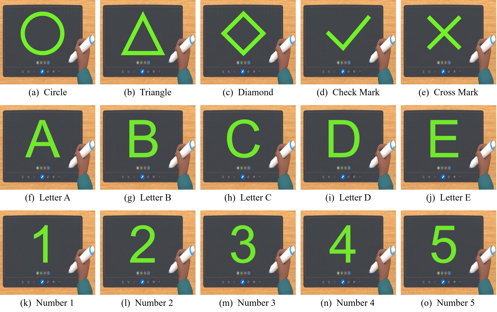

# AcouListener_v3

## Introduction
AcouListener_v3 is an application designed to recognize handwritten input in VR meetings.

## Features
1. **RECORD_START Button**: Initiates the audio recording process and starts recording.
2. **RECORD_STOP Button**: Stops the audio recording and saves it locally.
3. **PLAY_START Button**: Begins playing the training audio above 18 kHz.
4. **PLAY_STOP Button**: Stops playing the training audio.
5. **SHOW THE GESTURE Button**: Displays the recognized gesture.

## Instructions
1. Click the **PLAY_START Button** to start playing the training audio.
2. Click the **RECORD_START Button** to start collecting data for calculating the cir that records gesture information.
3. Click the **RECORD_STOP Button** to end the recording and complete data collection.
4. Click the **PLAY_STOP Button** to stop playing the training audio.
5. **SHOW THE GESTURE Button**: Shows the gesture recognized based on cir.

## Technical Support
For any questions or suggestions, please contact us.
