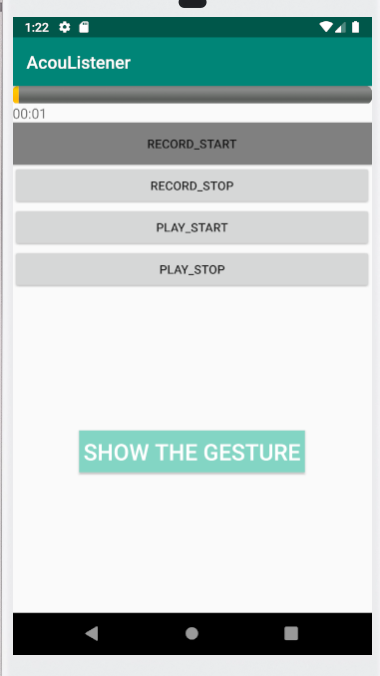

# AcouListener_v3

## Introduction
AcouListener_v3 is an application designed to recognize handwritten input in VR meetings.

## Features
1. **RECORD_START Button**: Initiates the audio recording process and 开始录音.
2. **RECORD_STOP Button**: Stops the audio recording并保存到本地.
3. **PLAY_START Button**: Begins playing the 高于18khz的训练音频.
4. **PLAY_STOP Button**: Stops 播放训练音频
5. **SHOW THE GESTURE Button**: Displays the recognized gesture.

## Instructions
1. Click the "Start Recording" button to begin recording audio.
2. Click the "Borrow Recording" button to save the recorded audio.
3. Click the "Start Playback" button to start playing the recorded audio.
4. Click the "Stop Playback" button to end the current audio playback.
5. Click the "Display Image" button to view an image.

## Technical Support
For any questions or suggestions, please contact us.

## Version History
- v3.0: Initial release

I hope this template helps you in writing your README file. If you need further assistance or have any other questions, feel free to let me know!