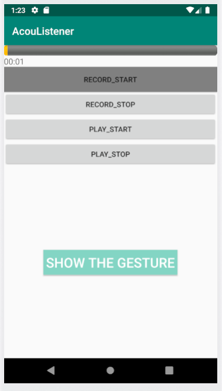

# AcouListener: An Inaudible Acoustic Side-channel Attack on Augmented and Virtual Reality Systems
AR/VR devices deployed in close approximation to human bodies can continually collect human-sensitive data and become the targets of malicious attacks. To better understand the threats in AR/VR systems, we investigate a new concealed side-channel attack via inaudible acoustic signals, which can be sent and received by commercial off-the-shelf VR headsets and mobile phones. We name such an attack system as AcouListener. After processing received acoustic signals, we can capture the unique features of a victim's hand movements by a portable convolutional neural network. We implement AcouListener as a camouflaged mobile app, which can be installed on a VR device or mobile phone. We conduct extensive experiments targeting three common attack scenarios: (1) inferring victims' unlocking patterns, (2) inferring victims' handwriting patterns, and (3) inferring victims' typing words or passwords in virtual keyboards. Experimental results show that AcouListener achieves an average accuracy of 84% in unlocking pattern recognition, 96% in handwriting recognition, and 72% in typing recognition.

# Experimental Setup:
- ## Hardware devices.
  * VR device: Oculus Quest 2
  * Mobile phone: Honor X10 and iPhone 12 pro

- ## Volunteers
  * 10 volunteers with varied ages (20-30 years old), heights (158-185cm), and genders (7 males and 3 females)

- ## Attack Scenario
  * Scenario 1: Unlocking Pattern Recovery
  * Scenario 2: Leakage of Hand-Written Content
  * Scenario 3: Leakage of Hand Typing on Virtual Keyboards

# Data Collection:
- ## Experiment Setup
In the attack scenarios, a volunteer sits on a chair in front of the desk, wears an Oculus Quest 2 HMD, holds the controllers in both hands, and makes corresponding hand movements. At the same time, a mobile phone was adopted to emit and receive corresponding inaudible audio and capture the volunteers’ hand movements. 

- The length of the collected audio is 5 seconds. The data can all be found at:
`cd /dataset/audio_dataset`  

- Once the data collection is completed, the next step is to pre-process the data. Convert the collected audio into a CIR image. The calculation script can be found in:
`cd /dataset/audio_dataset`  

- The processed cir data can all be found at:
`cd /dataset/cir_dataset`  

- With the collected data, CNN models for recognizing gestures can be trained. Models trained based on different scene data can recognize gestures suitable for the requirements of the scene. The Script for training CNN models can all be found at:
`cat /cnn_model/train_cnn.py`  

# AcouListener
## Introduction
We have developed an Android based application, namely AcouListener. This application can transmit training audio at inaudible frequency band, collect audio, and calculate CIR in attack scenarios. Subsequently, through a built-in network model trained specifically for the attack scenario, the application is able to recognize the corresponding gestures.

## Features
1. **RECORD_START Button**: Initiates the audio recording process and starts recording.
2. **RECORD_STOP Button**: Stops the audio recording and saves it locally.
3. **PLAY_START Button**: Begins playing the training audio above 18 kHz.
4. **PLAY_STOP Button**: Stops playing the training audio.
5. **SHOW THE GESTURE Button**: Displays the recognized gesture.

## Instructions
1. Click the **PLAY_START Button** to start playing the training audio.
2. Click the **RECORD_START Button** to start collecting data for calculating the cir that records gesture information.
3. Click the **RECORD_STOP Button** to end the recording and complete data collection.
4. Click the **PLAY_STOP Button** to stop playing the training audio.
5. Click the **SHOW THE GESTURE Button** Shows the gesture recognized based on cir.
